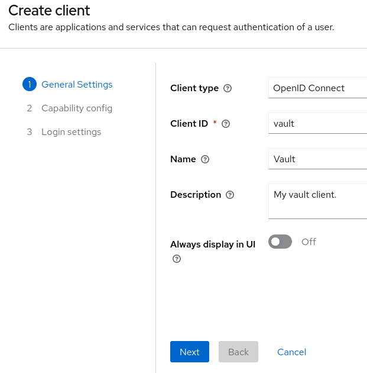

# Setup

The goal of this setup is to configure keycloak with vault.

# Commands

```bash
# bring everything up
docker-compose up -d

# bring everything down
docker-compose down
```

# Steps

## Keycloak

### Login

Open [keycloak](http://localhost:8080/) and use `root:root` to login as an admin.

### Create a realm

Use the dropdown menu in the top left to create a new realm.


### Create a client

Select the created realm, then go to `Clients` and click `Create client`.





Now create the vault client.

### Map roles to token

Now we need to tell keycloak that the user roles should be part of the id-token.


Now inspect the created mapper and ensure that `Add to ID token` is switched `ON`.


The `token claim name` should be set to `resource_access.${client_id}.roles` by default. Remember
this information, because this is the path where the roles will be stored.
The id token which vault will get will look something like this:

```json
{
    "iss": "foo",
    "sub": "bar",
    "resource_access": {
        "vault": {
            "roles": [
                "dev"
            ]
        }
    }
}
```

### Create a user and role

Click on `Users`, then `Add user`.


Choose a username, click on `Email verified` and then `Create`.


Now set a password by switching to the `Credentials` tab and pressing on `Set password`.


I set `foobar` as my password.
Don't forget to switch off the `Termporary` option.


Now we need our `dev` role. For this, click on `Roles`, then `Create role`.


### Assign user to role

Click on `Users` and then on your user.


Switch to the `Role mapping` tab and click `Assign role`.


Select the `dev` role and then click `Assign`.


Aaaaaaaand we are done with the keycloak configuration.

## Vault

The plan is to:

1. Enable the oidc auth method
2. Configure vault to use keycloak
3. Map the keycloak roles to vault groups
4. Assign policies to that groups

### Set env vars

First let's make sure we can connect to vault:

```bash
export VAULT_ADDR="http://localhost:8200"
export VAULT_TOKEN="root"
vault token lookup
```

<details>
    <summary>
        Expected output
</summary

    ```bash
    14:40 ➜ vault token lookup                                                      
    Key                 Value
    ---                 -----
    accessor            oqmYXn9VssJcQfnWTaDBCxdV
    creation_time       1691841063
    creation_ttl        0s
    display_name        token
    entity_id           n/a
    expire_time         <nil>
    explicit_max_ttl    0s
    id                  root
    issue_time          2023-08-12T11:51:03.904461013Z
    meta                <nil>
    num_uses            0
    orphan              true
    path                auth/token/create
    policies            [root]
    renewable           false
    ttl                 0s
    type                service
    ```
</details>

### Enable oidc auth method

```bash
vault auth enable oidc
```

### Configure the auth method

```bash
vault write auth/oidc/config \
    oidc_discovery_url="http://keycloak:8080/realms/foo" \
    oidc_client_id="vault" \
    oidc_client_secret="1Y6gvkgW3ChR4WVlgBJui3fgqOqvaD2N" \
    default_role="default"
```

Ok, let me explain.

**oidc_discovery_url**: This is just the URL to your realm. You can get this by 
going to your `Realm settings` and clicking on `OpenID Endpoint Configuration`.

**oidc_client_id**: This is the client id we used in the beginning.

**oidc_client_secret**: You can get this by going to your client config, going to
the `Credentials` tab and read the field `Client secret`.


**default_role**: The name of the default role every user gets who uses this auth method.
This role does not exist yet.

### Let's create some vault policies

```bash
# Just allow listing secrets, no reading
vault policy write listonly -<<EOF
path "/secret/*" {
    capabilities = ["list"]
}
EOF

# Allow everything
vault policy write manage -<<EOF
path "/secret/*" {
    capabilities = ["create", "read", "update", "delete", "list"]
}
EOF
```

### Adding the default role

```bash
vault write auth/oidc/role/default \
    bound_audiences="vault" \
    allowed_redirect_uris="http://vault:8250/oidc/callback" \
    allowed_redirect_uris="http://vault:8200/ui/vault/auth/oidc/oidc/callback" \
    groups_claim="/resource_access/vault/roles" \
    user_claim="sub" \
    policies=listonly
```

If you login now, you should be able to see the `secret/` mount.
In case you getting an error like `Missing auth_url.`, be sure to use the correct hostname.
It should match with the hostname you just configured in the `allowed_redirect_uris`
parameter. I have an `127.0.0.1 vault` entry in my `/etc/hosts` file. If you don't have that,
change the parameter to `localhost`.

### Map keycloak dev to vault manage policy

```bash
# Create an external group
vault write identity/group name="developers" type="external" \
         policies="manage" \
         metadata=responsibility="Manage Secrets"

# Create a group-alias which maps the dev group to the developers group
# The name must match the keycloak role!
vault write identity/group-alias name="dev" \      
     mount_accessor="$(vault auth list -format=json  | jq -r '."oidc/".accessor')" \        
     canonical_id="$(vault read -field=id identity/group/name/developers)"
```
